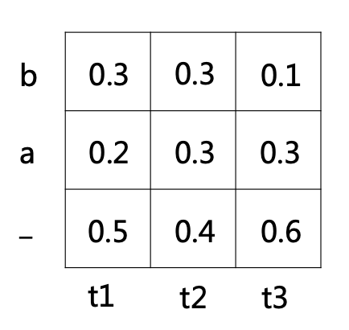
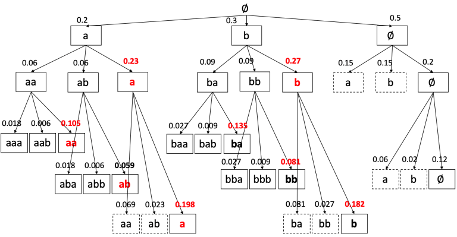
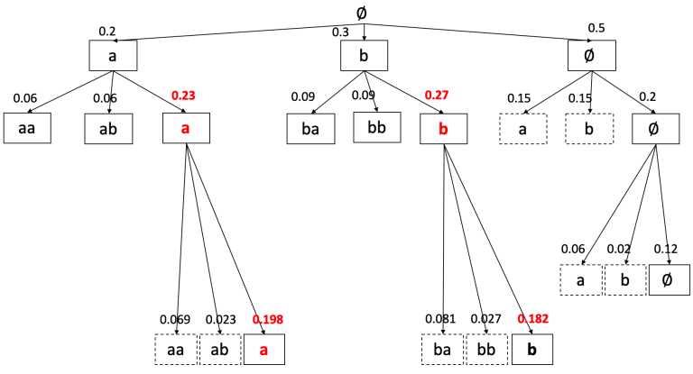

## CTC 解码算法

不同于一般的任务，训练完成以后直接可以预测输出。序列相关的任务由于输出序列长度不确定，解码输出过程就是一个在解空间内搜索得到最大概率输出的过程。一般而言，输出的算法主要有两种：CTC Prefix Search Decoding 和 beam serach

### Greedy

贪婪算法，最简单的方法，就是在每一步选取概率最大的标签。

### CTC Prefix Search Decoding

TODO

### CTC beam search

Beam Search的过程非常简单，每一步搜索选取概率最大的W个节点进行扩展，W也称为Beam Width，其核心还是计算每一步扩展节点的概率。
从一个简单的例子来看下搜索的穷举过程，T=3，字符集为{a, b}，其时间栅格表如下图：

横轴表示时间，纵轴表示每一步输出层的概率，$T=3$，字符集为$\{a, b\}$
如果对它的搜索空间进行穷举搜索，则每一步都展开进行搜索，如下图所示：

如上所述，穷举搜索每一步都要扩展全部节点，能保证最终找到最优解（上图中例子最优解$l*=b，p(l*)=0.164$），但搜索复杂度太高，而Beam Search的思路很简单，每一步只选取扩展概率最大的W个节点进行扩展，如下图所示：

由此可见，Beam Search实际上是对搜索数进行了剪枝，使得每一步最多扩展 W 个节点，而不是随着 T 的增加而呈指数增长，降低了搜索复杂度。
